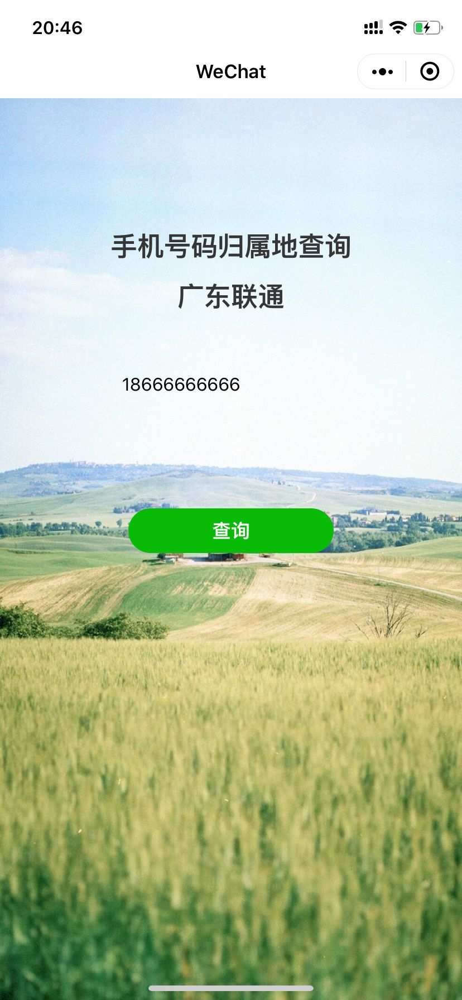
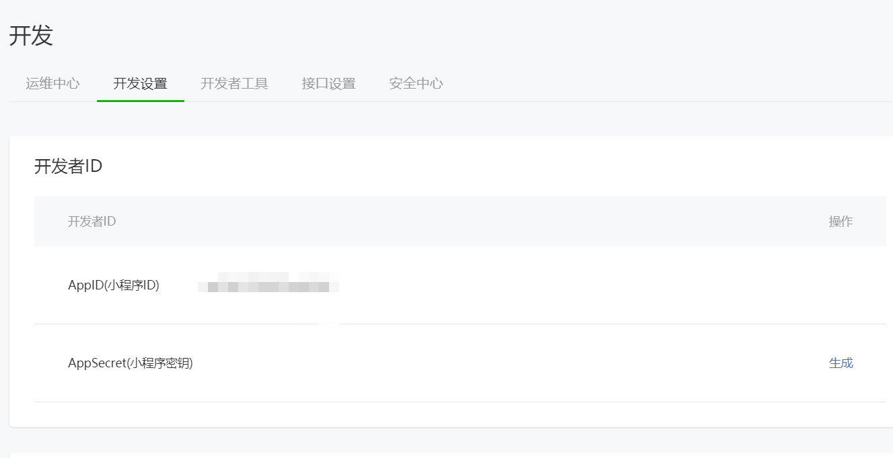
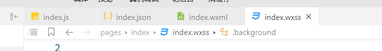
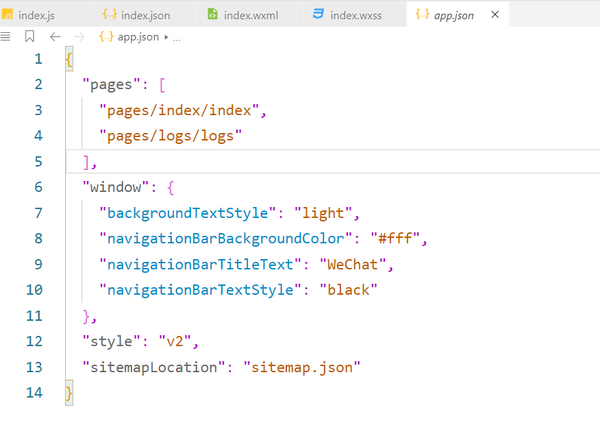
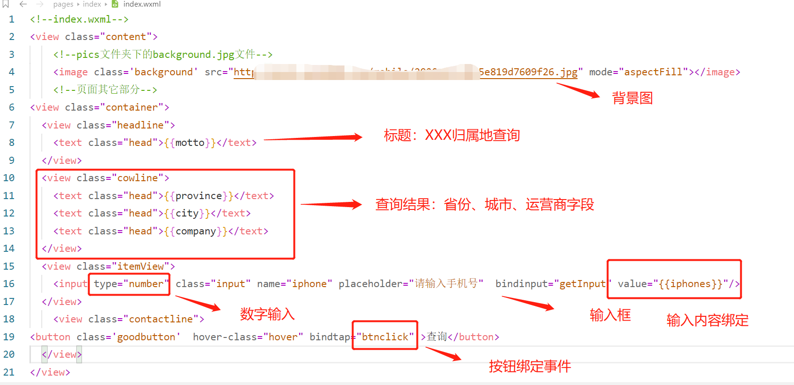
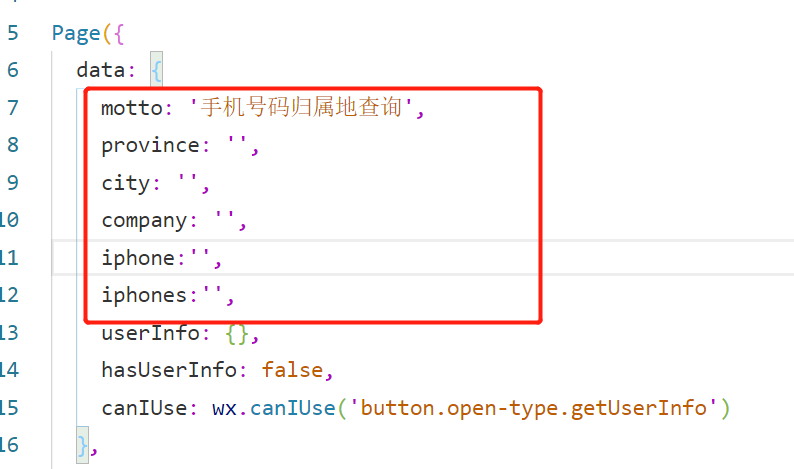

**特别提示：pic文件夹是图片存放，不用导入或打包项目里。**

&nbsp;&nbsp;&nbsp;&nbsp;虽然不是专业做微信小程序的，但是尝试做一个简单的demo了解一下开发流程还是可以的。
这次做了一个手机号码归属地查询的小程序。做出来的实物如图： 

&nbsp;&nbsp;&nbsp;&nbsp;理论上也很简单，就是找一个可查归属地的API进行接口调用，做一个返回数据展示而已。
只要你会JavaScript，真的是分分钟上手，但是小程序上线还是比较繁琐的，而且要学着用微信小程序的IDE
所谓开发一小时，上线等几年。 

&nbsp;&nbsp;&nbsp;&nbsp;关于微信小程序的技术文档见官方网站：[http://nginx.org/en/](http://nginx.org/en/)
  个人觉得写得异常细致。   

&nbsp;&nbsp;&nbsp;&nbsp;

   * 1、**申请账号**   
     &nbsp;&nbsp;&nbsp;&nbsp;申请账号的地址 
     [https://mp.weixin.qq.com/wxopen/waregister?action=step1](https://mp.weixin.qq.com/wxopen/waregister?action=step1)
        
     &nbsp;&nbsp;&nbsp;&nbsp;微信这点比较坑，可能由于管理需求。个人开发的话，虽然一个人名下可以有五个小程序，但一个邮箱只能对应管理一个小程序。
     如果你想开发多个，还得多用几个邮箱，非常麻烦。   
     &nbsp;&nbsp;&nbsp;&nbsp;按流程注册完成之后，会有一个**AppID(小程序ID)**，这个ID很重要。在IDE创建项目和项目上线都是需要的。
     

   * 2、**安装开发者工具IDE**   
     &nbsp;&nbsp;&nbsp;&nbsp;   [https://developers.weixin.qq.com/miniprogram/dev/devtools/download.html](https://developers.weixin.qq.com/miniprogram/dev/devtools/download.html)
        
     &nbsp;&nbsp;&nbsp;&nbsp; 我这里用的是稳定版 Stable Build。微信的IDE界面还行，但是拓展功能很差，快捷键支持的也不多，不是特别好用
     。我大致给画一下区域   
     

   * 3、**基本认识**   
     &nbsp;&nbsp;&nbsp;&nbsp; 这里我们首先要认识四种文件类型 **json、、js、wxml、wxss**。  
     
        &nbsp;&nbsp;&nbsp;&nbsp; json和js大家都很熟悉了，微信小程序用json存储数据或是写配置信息等。js用来写JavaScript。
        令人好奇的是wxml、wxss到底是什么东西，大家都很熟悉HTML + CSS + JS的模式。实际上wxml就是html,而wxss就是写样式的css。
        wxml也有类似vue的那种{{}}绑定数据的方法。wxss增加了一个rpx的计量单位，方便手机操作。我发现这套模式对有的原生html写法
        有很多不兼容的地方，还得考虑安卓和ios的兼容性问题等。我们只是做一个demo的话、暂时不去学这些东西，就当作HTML + CSS + JS的模式
        去写吧，遇到具体的问题再具体解决。  
         

    &nbsp;&nbsp;&nbsp;&nbsp;微信小程序有一个主配置文件就是app.json，我们可以看出来是配置index和背景样式之类的东西，这里我们暂时不用改这些。

   * 4、**开发**   
     &nbsp;&nbsp;&nbsp;&nbsp;终于讲到开发内容了，我们看上图的app.json，就知道index对应的目录为 pages/index/index,也就是打开小程序的第一个页面。于是我们首先来看这个html怎么写，哦、不，wxml怎么写，非常简单的写一个。
      
       &nbsp;&nbsp;&nbsp;&nbsp;   
       wxml也是支持那种类似vue双括号{{}}绑定value的写法，我标的很详细。写好之后在js的data{}里声明数据就轻松实现js对绑定value的操作了。

  
 &nbsp;&nbsp;&nbsp;&nbsp;样式方面可以自己在wxss里面设置，无非就是改view的class长宽高，这里我主要说一下背景图片的样式：
     

      page{
        height:100%;
      }
      .background {
        width: 100%;
        height: 100%;
        position:fixed; 
        background-size:100% 100%;
        z-index: -1;
      }

 &nbsp;&nbsp;&nbsp;&nbsp;最后就是js的写法了，之前我们在查询按钮绑定了一个事件btnclick，我们只需要声明一个点击调用API的函数即可。
 查询手机号码归属的免费API非常多，读者可自行查阅。这里用了wx.request来发起请求：
    

       btnclick:function(){
           var iphone = this.data.iphones;
           var that = this;
           var key = "调用API的key，不用key可以不写";
           if(iphone != null && iphone != ''){
           wx.request({
             url: 'https://apis.juhe.cn/mobile/get?phone='+iphone+'&key='+key, //API的URL
             data: {
             },
             header: {
               'content-type': 'application/json' // 默认值
             },
             success (res) {
               console.log(res.data);
                 if(res.data.result == null){
                   that.setData({
                     province: "号码不存在",
                     city:"",
                     company: "" 
                    })
                 }else{
                   if(res.data.result.city == res.data.result.province){ //这里是防止出现 北京北京联通的情况，直辖市用法
                     that.setData({
                       province: res.data.result.province,
                       city: "",
                       company: res.data.result.company,
                      })
                   }else{
                     that.setData({
                       province: res.data.result.province,
                       city: res.data.result.city,
                       company: res.data.result.company,
                      })
                   }
                 }
               }
           })      
           }
       },

 &nbsp;&nbsp;&nbsp;&nbsp;有些重要的点说一下，首先是这里必须要用var that = this;的定义去用this。
 然后不同的接口返回的res.data的json格式肯定不同，请自行调整。 
 &nbsp;&nbsp;&nbsp;&nbsp;**重要的一点**每个微信小程序需要事先设置通讯域名，小程序只可以跟指定的域名进行网络通信。也就是说，**你不配的话这个接口是调用不通的** 
 &nbsp;&nbsp;&nbsp;&nbsp;1、服务器域名请在 「小程序后台-开发-开发设置-服务器域名」 中进行配置，配置时需要注意： 
 &nbsp;&nbsp;&nbsp;&nbsp;2、域名只支持 https (wx.request、wx.uploadFile、wx.downloadFile) 和 wss (wx.connectSocket) 协议； 
 &nbsp;&nbsp;&nbsp;&nbsp;3、域名不能使用 IP 地址（小程序的局域网 IP 除外）或 localhost； 
 &nbsp;&nbsp;&nbsp;&nbsp;4、可以配置端口，如 https://myserver.com:8080，但是配置后只能向 https://myserver.com:8080 发起请求。如果向 https://myserver.com、https://myserver.com:9091 等 URL 请求则会失败。 
 &nbsp;&nbsp;&nbsp;&nbsp;5、如果不配置端口。如 https://myserver.com，那么请求的 URL 中也不能包含端口，甚至是默认的 443 端口也不可以。如果向 https://myserver.com:443 请求则会失败。 
 &nbsp;&nbsp;&nbsp;&nbsp;6、域名必须经过 ICP 备案； 
 &nbsp;&nbsp;&nbsp;&nbsp;7、出于安全考虑，api.weixin.qq.com 不能被配置为服务器域名，相关API也不能在小程序内调用。 开发者应将 AppSecret 保存到后台服务器中，通过服务器使用 getAccessToken 接口获取 access_token，并调用相关 API； 
 &nbsp;&nbsp;&nbsp;&nbsp;8、对于每个接口，分别可以配置最多 20 个域名。
       
         * 5、**上传代码及版本管理**       
 &nbsp;&nbsp;&nbsp;&nbsp;小程序写好之后进行模拟器测试的同时，一定要真机调试一下，看一下有没有兼容性的问题。IDE集成了真机调试的功能。 
 &nbsp;&nbsp;&nbsp;&nbsp;微信小程序的代码有四个版本，分别是开发版、体验版、审核版和线上版 
 &nbsp;&nbsp;&nbsp;&nbsp; 当你把开发板上传之后就生成了体验版，可用来进行测试。测试无误之后
 即可发布审核版，在微信官方审核之后，即可上线成为线上版本。审核大约在几天时间。
      
 &nbsp;&nbsp;&nbsp;&nbsp; 本人授权[维权骑士](http://rightknights.com)对我发布文章的版权行为进行追究与维权。未经本人许可，不可擅自转载或用于其他商业用途。

 

​      
​      
​      
​      